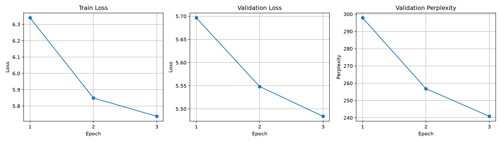

# LoRA Fine-Tuning on Tiny Shakespeare


## Overview

This project fine-tunes **GPT-2 small** (117M parameters) on the **Tiny Shakespeare** corpus using **LoRA** (Low-Rank Adaptation). Only **0.12%** of the model is trained—**147,456** parameters out of **124M**—while the frozen base weights stay fixed. On the validation set, perplexity drops from **10,157** to **241**, a **42×** improvement.

## What is LoRA?

LoRA keeps the pretrained base model frozen and learns a low-rank update to selected weight matrices. Instead of fine-tuning the full weight matrix $W$, the adaptation is decomposed as:

$$
\Delta W = B \cdot A
$$

where $A \in \mathbb{R}^{r \times d_\text{in}}$ and $B \in \mathbb{R}^{d_\text{out} \times r}$ with rank $r \ll \min(d_\text{in}, d_\text{out})$. Only **A** and **B** are trained; at inference time the update can be merged back into $W$.

## Project structure

```
lora-finetune/
├── main.py                      # CLI entry point (train / evaluate)
├── demo.ipynb                   # Jupyter demo with plots and comparisons
├── requirements.txt             # Pinned Python dependencies (PyTorch CPU)
├── data/
│   └── dataset.py               # Tiny Shakespeare download, split, and token blocks
├── model/
│   ├── __init__.py              # Package exports (LoRALayer)
│   ├── lora_layer.py            # LoRA wrapper around frozen nn.Linear layers
│   └── base_model.py            # GPT-2 with LoRA on attention c_proj projections
├── train/
│   ├── config.py                # TrainingConfig dataclass (hyperparameters)
│   └── trainer.py               # Training loop, validation, checkpoints, plotting
├── evaluate/
│   └── evaluator.py             # Perplexity and generation comparison (base vs fine-tuned)
└── outputs/
    └── training_history.png     # Saved training curves (train/val loss, perplexity), written by Trainer.plot_history()
```

Checkpoints are written to `checkpoints/` during training (e.g. `checkpoint_epoch_3.pt`).

## Installation

```bash
git clone https://github.com/FraViss/lora-finetune
cd lora-finetune
uv venv --python 3.12
.venv\Scripts\activate
uv pip install -r requirements.txt
```

## Usage

Train LoRA adapters on Tiny Shakespeare:

```bash
python main.py train
```

Compare base GPT-2 against the fine-tuned checkpoint:

```bash
python main.py evaluate
```

Resuming a training run: `Trainer.train(start_epoch, checkpoint)` loads a saved `state_dict` and continues from `start_epoch`. Running `train/trainer.py` directly auto-detects this—if `checkpoint_epoch_{N-1}.pt` exists but the final epoch's checkpoint doesn't, it resumes from the second-to-last checkpoint instead of restarting.

`demo.ipynb` walks through the same comparison interactively: it loads `outputs/training_history.png`, reruns `Evaluator.compare_perplexity()` and `compare_generation()`, and prints the results inline—useful for re-checking a checkpoint without going through the CLI.

### Hyperparameters (`train/config.py`)

| Parameter | Value | Notes |
|---|---:|---|
| `rank` | 8 | LoRA rank `r` for the low-rank decomposition |
| `alpha` | 16.0 | Scaling factor; effective scale is `alpha / rank` = 2.0 |
| `block_size` | 128 | Tokens per training example |
| `batch_size` | 8 | |
| `learning_rate` | 3e-4 | AdamW, applied only to LoRA parameters |
| `num_epochs` | 3 | |
| `device` | cpu | No GPU required |

## Results

Training runs on CPU—no GPU required. On the machine used here, one epoch took roughly **45–80 minutes** depending on system load; expect similar order-of-magnitude timing on a modern multi-core CPU.

| Epoch | Train loss | Val loss | Val perplexity |
|------:|-----------:|---------:|---------------:|
| 1 | 6.3400 | 5.6966 | 297.86 |
| 2 | 5.8498 | 5.5484 | 256.83 |
| 3 | 5.7372 | 5.4841 | 240.83 |

Validation perplexity improved from **~10,157** (base GPT-2) to **~241** (fine-tuned)—roughly a **42×** reduction—after three epochs of LoRA training.



### Sample generations

Same prompt, base GPT-2 vs. the epoch-3 LoRA checkpoint (`max_new_tokens=120`, sampling with `temperature=0.8`, `top_p=0.95`):

**Prompt:** `"To be or not to be"`

| Base GPT-2 | Fine-tuned |
|---|---|
| *To be or not to be a member of the National Security Council, any person is a foreign national. (2) The person's nationality is the nationality of another person...* | *To be or not to be a,'s and, you the in in and, in as, you in with the, and,,, it and of you, but, the it you and, the with the like which you do you not...* |

**Prompt:** `"Shall I compare thee"`

| Base GPT-2 | Fine-tuned |
|---|---|
| *Shall I compare thee with a man who makes a lot of money for a lot of people?" "No, sir." "Well, you're in the wrong place."...* | *Shall I compare thee my for me who will all my will your my own are the. of A I'd him of man a; what should you not but I his?? I thee, thy thou...* |

The full three-prompt comparison is in `demo.ipynb`. Note the fine-tuned model clearly picks up Shakespearean vocabulary (`thee`, `thy`, `thou`) and punctuation/line-break patterns absent from the base model's output—but the result reads as far less coherent English than the base model's. This is expected here, not a bug: perplexity measures how well the model predicts the *next token* against Tiny Shakespeare's actual (often fragmented, verse-like) text, which rewards matching its punctuation and phrasing quirks rather than producing fluent prose. See [Limitations](#limitations--future-work) below.

## Key design choices

- **GPT-2 small** — Small enough to train on CPU in reasonable time, yet large enough to show meaningful adaptation with LoRA.
- **Tiny Shakespeare** — A classic, compact language-modeling benchmark with distinctive style; easy to download and split for train/validation.
- **LoRA on `c_proj` only** — Adapters are attached to each attention block’s output projection, targeting where attention outputs are mixed before the next sublayer.
- **Asymmetric initialization** — `lora_A` is Gaussian (std 0.02) and `lora_B` is zero, so the LoRA path starts inactive and training gradually introduces the low-rank update.

## Limitations & future work

- **Perplexity vs. fluency diverge.** The fine-tuned model scores dramatically lower perplexity but generates less fluent text than base GPT-2 (see [Sample generations](#sample-generations)). With only `c_proj` adapted, a rank of 8, and 3 epochs, the model appears to overfit to Tiny Shakespeare's surface statistics—punctuation density, line breaks, archaic pronouns—faster than it learns coherent long-range structure. Likely fixes: more epochs, a higher rank, or adapting `c_attn` (query/key/value) as well as `c_proj`.
- **`block_size=128`** is short relative to GPT-2's 1024-token context window, which limits how much long-range structure each training example can capture.
- **Character-level train/val split** (`data/dataset.py` splits the raw text at 90%, then tokenizes each half separately) means the split boundary can fall mid-token or mid-scene; a token-level split would be cleaner.
- **No held-out test set**—only train/val—so the reported perplexity doubles as the value used to pick the "best" checkpoint, which risks mild optimistic bias.

## License

MIT
